# **Traffic Sign Recognition** 

**Build a Traffic Sign Recognition Project**

The goals / steps of this project are the following:
* Load the data set (see below for links to the project data set)
* Explore, summarize and visualize the data set
* Design, train and test a model architecture
* Use the model to make predictions on new images
* Analyze the softmax probabilities of the new images
* Summarize the results with a written report

[//]: # (Image References)

[image1]: ./examples/data_quantity.jpg "Data Quantity"
[image2]: ./examples/visualization.jpg "Visualization"
[image_n]: ./examples/few_labels.jpg "Few Labels"
[image3]: ./examples/grayscale.jpg "Grayscaling"
[image4]: ./examples/random_noise.jpg "Random Noise"
[image5]: ./web_images/double_curve.png "Traffic Sign 1"
[image6]: ./web_images/general_warning.png "Traffic Sign 2"
[image7]: ./web_images/slippery_road.jpg "Traffic Sign 3"
[image8]: ./web_images/speed_70.jpg "Traffic Sign 4"
[image9]: ./web_images/Turning_right_mandatory.png "Traffic Sign 5"

## Rubric Points
### Here I will consider the [rubric points](https://review.udacity.com/#!/rubrics/481/view) individually and describe how I addressed each point in my implementation.  

---
### Writeup / README

#### 1. Provide a Writeup / README that includes all the rubric points and how you addressed each one. You can submit your writeup as markdown or pdf. You can use this template as a guide for writing the report. The submission includes the project code.

You're reading it! and here is a link to my [project code](https://github.com/JulioZanotto/CarND_TrafficSignCLassifier_P3/Traffic_Sign_Classifier.ipynb)

### Data Set Summary & Exploration

#### 1. Provide a basic summary of the data set. In the code, the analysis should be done using python, numpy and/or pandas methods rather than hardcoding results manually.

I used the numpy library to calculate summary statistics of the traffic
signs data set:

* The size of training set is 34799
* The size of the validation set is 4410
* The size of test set is 12630
* The shape of a traffic sign image is 32 x 32 with 3 color channels
* The number of unique classes/labels in the data set is 43

Here is an image with the results, which is in Section Basic Summary on the notebook:

![alt text][image1]

#### 2. Include an exploratory visualization of the dataset.

Here is an exploratory visualization of the data set. It is a histogram showing how the data. We can see an extremelly unbalanced dataset, but the distribution is the same for validation and test, it can be seen on the Section Exploratory Visualization of the dataset

![alt text][image2]

Here we can see that the Speed Limits labels, are the ones with less than 250 examples:

![alt text][image_n]

### Design and Test a Model Architecture

#### 1. Describe how you preprocessed the image data. What techniques were chosen and why did you choose these techniques? Consider including images showing the output of each preprocessing technique. Pre-processing refers to techniques such as converting to grayscale, normalization, etc. (OPTIONAL: As described in the "Stand Out Suggestions" part of the rubric, if you generated additional data for training, describe why you decided to generate additional data, how you generated the data, and provide example images of the additional data. Then describe the characteristics of the augmented training set like number of images in the set, number of images for each class, etc.)

As a first step, I decided to convert the images to grayscale because it could help the model to generalize better, and not get the information based on the color, which can crate an bias.

Here is an example of a traffic sign image before and after grayscaling.

![alt text][image3]

As a last step, I normalized the image data because it is required by the model for a better performance and convergence.

I tried some augmentation like rotation or flip, but for images that are straight like curve to the right or left, this kind of augmentation would distort the original information of the image, adding more trouble than helping, I was going to try some Gaussian noise or pixel displacement for better results, but the model only with these achieved 97% aaccuracy.

#### 2. Describe what your final model architecture looks like including model type, layers, layer sizes, connectivity, etc.) Consider including a diagram and/or table describing the final model.

My final model consisted of the following layers:

| Layer         		|     Description	        					| 
|:---------------------:|:---------------------------------------------:| 
| Input         		| 32x32x1 Grayscale image   					| 
| Convolution 3x3     	| 1x1 stride, valid padding, outputs 30x30x16 	|
| RELU					|												|
| Max pooling	      	| 2x2 stride,  outputs 15x15x16 				|
| Convolution 3x3	    | 1x1 stride, valid padding, outputs 13x13x32 	|
| RELU					|												|
| Max pooling	      	| 2x2 stride,  outputs 6x6x32    				|
| Convolution 3x3	    | 1x1 stride, valid padding, outputs 4x4 x64	|
| RELU					|												|
| Max pooling	      	| 2x2 stride,  outputs 2x2x64                   |
| Dropout               | Keep Probability = 0.5                        |
| Fully connected		| Input = 2x2x64 (256) Outputs=43				|
| Softmax				| Output       									|
 

#### 3. Describe how you trained your model. The discussion can include the type of optimizer, the batch size, number of epochs and any hyperparameters such as learning rate.

To train the model, I used an batch size of 64, which I tought would converge better than update the weights after a batch of 128, during the test I found that 20 Epochs would get to a good result and the Learning rate I kept at 1e-3 with the Adam Optimizer.

#### 4. Describe the approach taken for finding a solution and getting the validation set accuracy to be at least 0.93. Include in the discussion the results on the training, validation and test sets and where in the code these were calculated. Your approach may have been an iterative process, in which case, outline the steps you took to get to the final solution and why you chose those steps. Perhaps your solution involved an already well known implementation or architecture. In this case, discuss why you think the architecture is suitable for the current problem.

My final model results were:
* training set accuracy of 99%
* validation set accuracy of 97% 
* test set accuracy of 95%

On my iterative approach, I started with LeNet architecture, with no change in the images, keep the colored channel, which achieved about 85% accuracy on validation set. From here I knew that I would need a more complex CNN model to achieve better results, so I thought about getting something similar to AlexNet, but it wouldnt work as the image is too small for a deep network, so I only improved the number of convolutions and the feature maps.

The fully connected layer I also made it a little bigger, like from the flatten that was about 1024 neurons, this on the first approach with feature maps going to 128/256, to 1024 and then to 512, and ending on the 43 classes. Here the model overfitted easily as I would imagine then I reduced the number of fully connected to a simple flatten(256) to 43 neurons.

Here the model was still getting 99% on training with 80% on validation, so I added the dropout layer after the Flatten and reduced the number of convolutions resulting in the model mentioned in earlier sections of this writeup.

Here the model had a good result, and in every restart it would achieve the minimum of 96% accuracy on validation. So I kept this architecture.

As we could see from Fully connected trying to classify images to Convolution networks, was clearly shown that the features maps created and the shared weights helped a lot on this task, the use of dropout for regularization I believe was the key to achieve this result.

If a well known architecture was chosen:
* What architecture was chosen?

Well I tried and thought about AlexNet as it was the next generation for the winning convolutional networks for the Image Net challenge, but as I tried a deep network couldnt deal with such small image, resulting in negative numbers after the convolutions and Poolings. So I only improved the number of feature maps and added another convolutional layer.

### Test a Model on New Images

#### 1. Choose five German traffic signs found on the web and provide them in the report. For each image, discuss what quality or qualities might be difficult to classify.

Here are five German traffic signs that I found on the web:

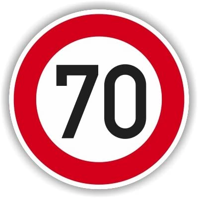 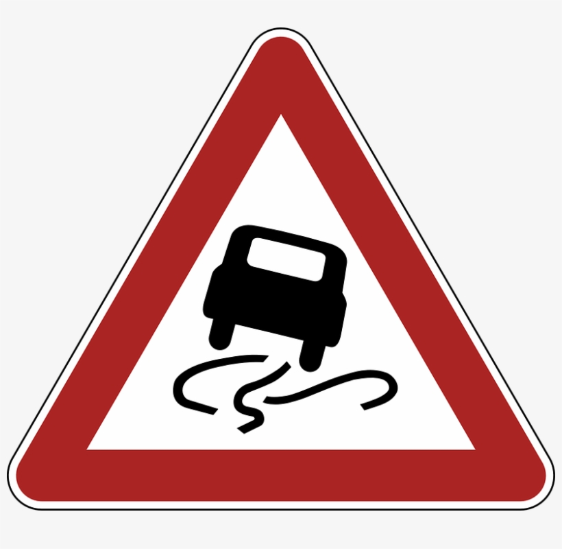 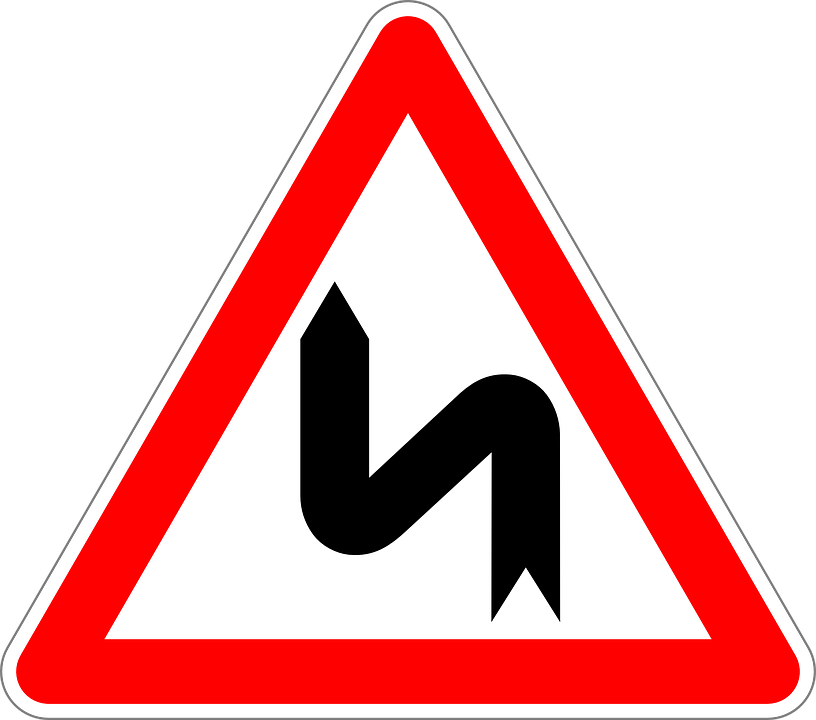  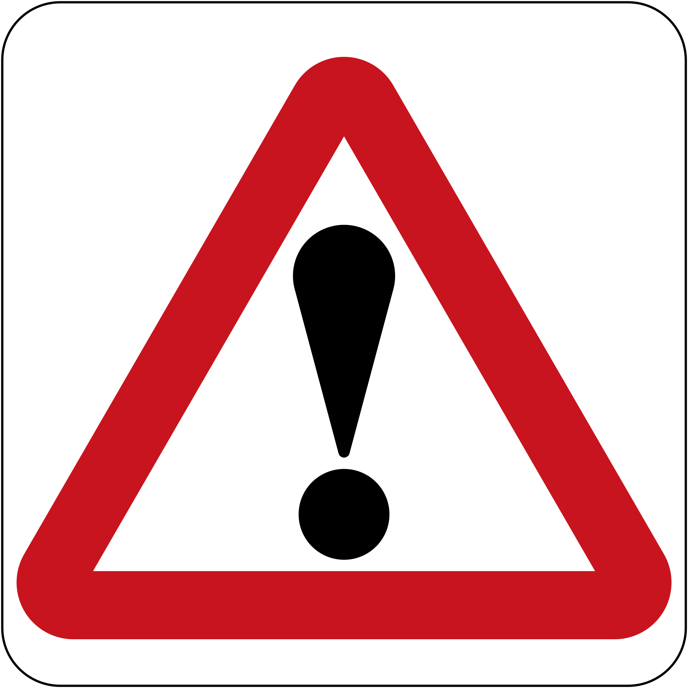    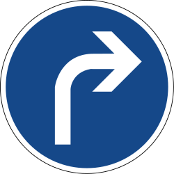 

The first image might be difficult to classify because it was on the lowest number of examples, but even though the model could get it right, the third image, which the model predicted incorret, where I thought it would get wrong because of the quality of the drawing in the middle, it got confused with an well draw arrow, perhaps because of the quantity of examples too.

All the other images, the model went well and could predict them, even the speed limit of 70, that is one with less examples in the training data.

#### 2. Discuss the model's predictions on these new traffic signs and compare the results to predicting on the test set. At a minimum, discuss what the predictions were, the accuracy on these new predictions, and compare the accuracy to the accuracy on the test set (OPTIONAL: Discuss the results in more detail as described in the "Stand Out Suggestions" part of the rubric).

Here are the results of the prediction:

| Image			        |     Prediction	        					| 
|:---------------------:|:---------------------------------------------:| 
| Speed limit (70km/h) 	| Speed limit (70km/h)							| 
| Slippery Road			| Slippery Road									|
| Double Curve			| Ahead Only									|
| General Caution  		| General Caution				 				|
| Turn Right Mandatory	| Turn Right Mandatory 							|

The model was able to correctly guess 4 of the 5 traffic signs, which gives an accuracy of 80%. This compares favorably to the accuracy on the test set of 95%, but as we chose less images it could impact on the result of the accuracy, if we chosen like 100 images, but I am happy with the results and the prediction on new images.

This results are shown in the Section Predict the Sign type in each Image of the notebook

#### 3. Describe how certain the model is when predicting on each of the five new images by looking at the softmax probabilities for each prediction. Provide the top 5 softmax probabilities for each image along with the sign type of each probability. (OPTIONAL: as described in the "Stand Out Suggestions" part of the rubric, visualizations can also be provided such as bar charts)

The code for making predictions on my final model is located in the Section Prediction for new Images and the output softmax for the top 5 probabilities on my notebook.

For the first image, the model is absolutely sure that this is a Speed Limit 70km/h sign (probability of 0.99), and the image does contain a Speed Limit sign of 70 km/h. The top five soft max probabilities were

| Probability         	|     Prediction	        					| 
|:---------------------:|:---------------------------------------------:| 
| .99        			| Speed limit (70km/h)							| 
| .01     				| General Caution								|
| .00					| Speed Limit (30km/h)							|
| .00	      			| Right of way at the next intersection 		|
| .00				    | End of speed limit 80km/h      				|

Here is the bar plot of the prediction

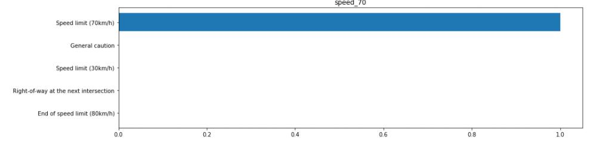 

For the second image the model was less sure, but made the right prediction anyway, this was the less sure of all.

| Probability         	|     Prediction	        					| 
|:---------------------:|:---------------------------------------------:| 
| .50        			| Slippery Road     							| 
| .44     				| Beware of ice/snow							|
| .04					| Right of way at the next intersection 		|
| .01	      			| Road narrows on the right              		|
| .01				    | Roundabout Mandatory           				|

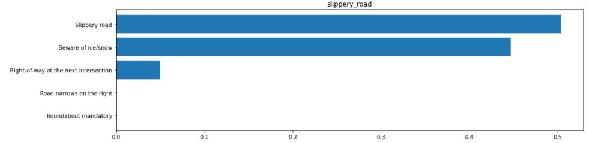 

For the third image the model was confident of the prediction, giving and extremelly high score of almost 1.0 like the other image, but this time making an incorrect prediction, making this confusion of double curve with Ahead only.

| Probability         	|     Prediction	        					| 
|:---------------------:|:---------------------------------------------:| 
| .99        			| Ahead only   	         						| 
| .00    				| Road work          							|
| .00					| Right of way at the next intersection 		|
| .00	      			| Road narrows on the right              		|
| .00				    | Turn left ahead           			    	|

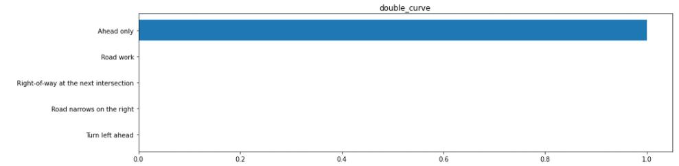 

For the fourth image the model was confident of the prediction, giving and extremelly high score of 1.0 almost like the other image, making a correct prediction.

| Probability         	|     Prediction	        					| 
|:---------------------:|:---------------------------------------------:| 
| 1.0        			| General Caution        						| 
| .00    				| Right of way at the next intersection     	|
| .00					| Traffic Signals                       		|
| .00	      			| Pedestrians                           		|
| .00				    | Road narrows on the right        				|

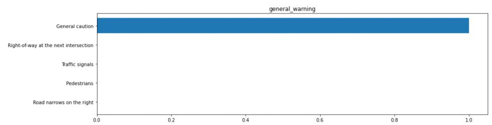 

For the fifth and image the model was confident of the prediction, giving and extremelly high score of 1.0 almost like the other image, making a correct prediction also.

| Probability         	|     Prediction	        					| 
|:---------------------:|:---------------------------------------------:| 
| 1.0        			| Turn right ahead        						| 
| .00    				| Keep Left     	                            |
| .00					| Go straight or right                       	|
| .00	      			| Stop                           		        |
| .00				    | Roundabout Mandatory         			      	|

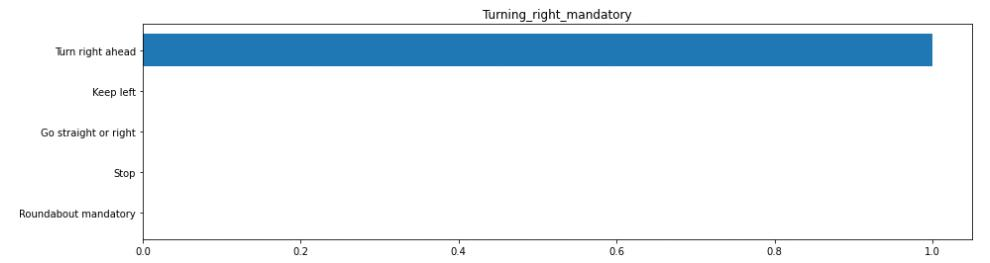 

All the probabilities and bar plots can be seen in Section of Top k probabilities in the notebook.

### (Optional) Visualizing the Neural Network (See Step 4 of the Ipython notebook for more details)
#### 1. Discuss the visual output of your trained network's feature maps. What characteristics did the neural network use to make classifications?

Here we could see the feature maps of the trained network. From this maps we can see what the convolutions extracted and used to make the predictions, na for the speed limit, it is clearly shown the circle of the sign and the number inside as the extracted caracteristic of the image.

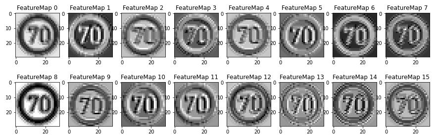 

